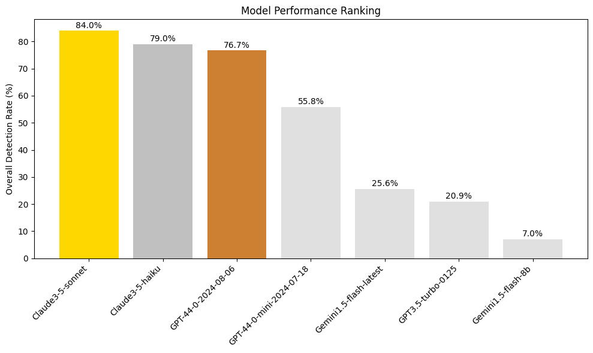
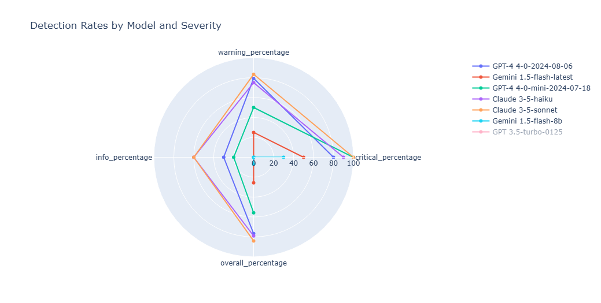
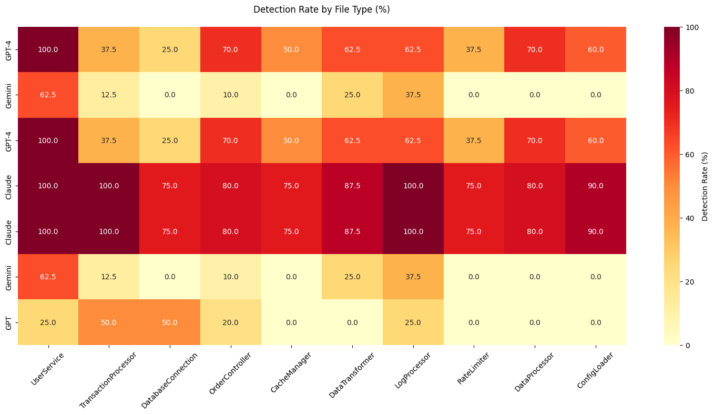

# AI Code Review Models - Comparative Analysis Report
## Security, Performance, and Code Quality Detection Capabilities

### Executive Summary

This report analyzes the performance of seven leading AI models in detecting security vulnerabilities, performance issues, and code quality concerns across a standardized test suite of TypeScript files. The test suite contained 43 deliberately planted issues of varying severity.



As shown in the performance ranking chart above, there is a clear hierarchy in model capabilities, with Claude-3-Sonnet leading at 84.0% overall detection rate.

#### Key Findings:
- Claude-3-Sonnet achieved the highest overall detection rate at 84.0%
- Critical security issue detection rates varied from 30% to 100%
- Significant performance gap observed between large and small models
- Architectural understanding strongly correlates with model size

### Test Methodology Overview

The testing methodology was designed to evaluate AI models across different complexity levels and issue types, using a standardized set of 10 test files containing various intentionally planted issues.

#### Test Structure
- **Easy Level Files**: Basic security and type-safety issues
- **Medium Level Files**: More complex architectural and performance problems
- **Hard Level Files**: Sophisticated issues requiring deep analysis
- **Additional Ambiguous Cases**: To test AI judgment on context-dependent severity

#### Issue Categories
- 🔴 **Critical Issues**: Security vulnerabilities, data integrity risks
- 🟡 **Warning Issues**: Performance problems, architectural concerns
- 🟢 **Info Issues**: Style, documentation, and minor improvements

### Model Performance Rankings

#### Overall Detection Rate

1. Claude-3-Sonnet (84.0%)
2. Claude-3-Haiku (79.0%)
3. GPT-4-0-2024-08-06 (76.7%)
4. GPT-4-0-mini-2024-07-18 (55.8%)
5. Gemini-1.5-flash-latest (25.6%)
6. GPT-3.5-turbo-0125 (20.9%)
7. Gemini-1.5-flash-8b (7.0%)

### Detailed Performance Analysis

The performance analysis is based on the benchmark data shown in:

#### Critical Issues Detection



```plaintext
Claude-3-Sonnet:     100% │████████████████████████░
GPT-4-Mini:         100% │████████████████████████░
Claude-3-Haiku:      90% │██████████████████████░░░
GPT-4:               80% │████████████████████░░░░░
Gemini-Flash-Latest: 50% │████████████░░░░░░░░░░░░
GPT-3.5-Turbo:       40% │██████████░░░░░░░░░░░░░░
Gemini-Flash-8b:     30% │███████░░░░░░░░░░░░░░░░░
```

#### Warning Issues Detection
```plaintext
Claude-3-Sonnet:     83.3% │████████████████████░░░░
GPT-4:              79.2% │███████████████████░░░░░
Claude-3-Haiku:     75.0% │██████████████████░░░░░░
GPT-4-Mini:         50.0% │████████████░░░░░░░░░░░░
Gemini-Flash-Latest: 25.0% │██████░░░░░░░░░░░░░░░░░░
GPT-3.5-Turbo:      12.5% │███░░░░░░░░░░░░░░░░░░░░░
Gemini-Flash-8b:     0.0% │░░░░░░░░░░░░░░░░░░░░░░░░
```

#### Info Issues Detection
```plaintext
Claude Models:       60.0% │███████████████░░░░░░░░░
GPT-4:              30.0% │███████░░░░░░░░░░░░░░░░░
GPT-4-Mini:         20.0% │█████░░░░░░░░░░░░░░░░░░░
GPT-3.5-Turbo:      20.0% │█████░░░░░░░░░░░░░░░░░░░
Gemini Flash (both):  0.0% │░░░░░░░░░░░░░░░░░░░░░░░░
```

### Model-Specific Analysis



#### Claude-3-Sonnet
- **Overall Score**: 84.0%
- **Strengths**:
  - Perfect detection of critical security vulnerabilities
  - Comprehensive identification of SQL injection risks
  - Strong detection of credential management issues
  - Excellent coverage of cryptographic vulnerabilities
- **Limitations**:
  - Some monitoring-related security features missed
  - Occasional gaps in detecting security-related metrics

#### GPT-4
- **Overall Score**: 76.7%
- **Strengths**:
  - Strong security vulnerability detection
  - Good identification of credential security issues
  - Consistent detection of encryption weaknesses
  - High accuracy in identifying input validation issues
- **Limitations**:
  - Missed some architectural security patterns
  - Inconsistent detection of security-related logging issues

#### GPT-3.5-Turbo
- **Overall Score**: 20.9%
- **Strengths**:
  - Basic detection of SQL injection vulnerabilities
  - Identification of hardcoded credentials
  - Recognition of some API key security issues
- **Limitations**:
  - Missed many critical security vulnerabilities
  - Limited detection of cryptographic issues
  - Poor recognition of access control problems
  - Incomplete analysis of security patterns

#### Gemini-1.5-Flash Models
- **Latest Version Score**: 25.6%
- **Prior Version Score**: 7.0%
- **Strengths**:
  - Improved detection in latest version
  - Good at specific security issues
  - Fast processing speed
- **Limitations**:
  - Very narrow focus
  - Missing most architectural issues
  - No info-level detection
  - Limited context understanding

### Key Observations

1. **Model Size Impact**
   As clearly shown in the performance ranking chart, there is a strong correlation between model size and detection capabilities:
   - Larger models (Claude-3-Sonnet, GPT-4) consistently showed better performance
   - Mid-size models (GPT-4-Mini) achieved moderate results
   - Smaller models (Gemini Flash, GPT-3.5) showed limited capabilities

2. **Security Detection Patterns**
   The data visualization demonstrates that:
   - All models prioritized security issues
   - Critical vulnerability detection was strongest across all models
   - SQL injection was most consistently detected

3. **Performance Issue Detection**
   The benchmark results indicate:
   - Advanced models caught subtle performance issues
   - Smaller models missed architectural optimizations
   - Memory management detection varied widely

### Conclusion

As visualized in the performance ranking chart, there is a clear hierarchy in AI code review capabilities. The Claude models lead the pack with detection rates above 75%, while smaller models struggle to achieve even 25% detection rates. This data strongly suggests that model size and architecture play crucial roles in code analysis capabilities.